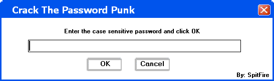



## Custom Form Example

### Description

This shows you how to have a custom form... Draging a form by clicking down on an object within the form... Also theres a bad example of password protection. Please vote if you want... I dont care or something.
 
### More Info
 

             |
---                |---
**Submitted On**   |2002-10-04 23:36:20
**By**             |[Jesse Seidel \(Dr\. Fire\)](https://github.com/Planet-Source-Code/PSCIndex/blob/master/ByAuthor/jesse-seidel-dr-fire.md)
**Level**          |Beginner
**User Rating**    |5.0 (10 globes from 2 users)
**Compatibility**  |VB 6\.0
**Category**       |[Coding Standards](https://github.com/Planet-Source-Code/PSCIndex/blob/master/ByCategory/coding-standards__1-43.md)
**World**          |[Visual Basic](https://github.com/Planet-Source-Code/PSCIndex/blob/master/ByWorld/visual-basic.md)
**Archive File**   |[Custom\_For1408431052002\.zip](https://github.com/Planet-Source-Code/jesse-seidel-dr-fire-custom-form-example__1-39551/archive/master.zip)

